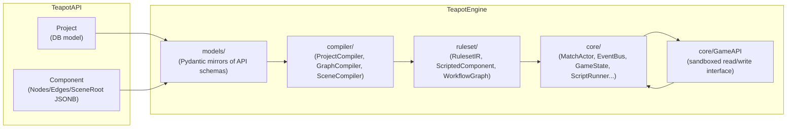

# New TeapotEngine Package

## Design Philosophy

The old `TeapotEngine-block` used a deeply nested data-model system — every
concept (trigger condition, effect, workflow edge type) required authoring a
typed Pydantic class hierarchy. This is too complex for end users to create
and too brittle for AI to generate reliably.

The new engine uses a **scripted component model**:

- Each component has a `ComponentKind` and either structured `parameters`
(for standard operations) or a `script` string evaluated at runtime.
- Scripts call a `GameAPI` — a sandboxed interface that exposes game state
reads and emits events for state changes.
- Components are wired together by a `WorkflowGraph` (kept from the old
engine unchanged).
- The engine loop (`MatchActor`, `EventBus`, `GameState`, `Stack`) is kept
from the old engine with minimal changes.




---

## Package Structure

```
TeapotEngine/
├── __init__.py
├── setup.py
├── README.md
├── core/                         # Engine loop — ported from TeapotEngine-block/core/ with changes
│   ├── __init__.py
│   ├── Engine.py
│   ├── MatchActor.py             # CHANGED: wires ScriptRunner + GameAPI; uses str component IDs
│   ├── GameState.py              # CHANGED: component IDs str not int
│   ├── GameAPI.py                # NEW: sandboxed interface scripts call at runtime
│   ├── ScriptRunner.py           # NEW: restricted-Python sandbox evaluator
│   ├── Events.py                 # Ported verbatim
│   ├── EventBus.py               # Ported verbatim
│   ├── EventRegistry.py          # Ported verbatim
│   ├── WorkflowExecutor.py       # Ported verbatim
│   ├── PhaseManager.py           # Ported verbatim
│   ├── Stack.py                  # Ported verbatim
│   ├── StateWatcherEngine.py     # Ported verbatim
│   ├── GameLoopResult.py         # Ported verbatim
│   ├── Component.py              # CHANGED: component IDs str not int
│   ├── rng.py                    # Ported verbatim
│   └── events/
│       └── turnEvents.py         # Ported verbatim
├── ruleset/                      # Slimmed down from TeapotEngine-block/ruleset/
│   ├── __init__.py
│   ├── IR.py                     # REWRITTEN: simplified RulesetIR
│   ├── ScriptedComponent.py      # NEW: ComponentKind + ScriptedComponent model
│   ├── RulesetModels.py          # Ported verbatim (ZoneVisibilityType etc.)
│   ├── Validator.py              # Ported verbatim — validates compiled RulesetIR
│   ├── models/
│   │   └── ResourceModel.py      # Ported verbatim
│   ├── state_watcher/
│   │   └── __init__.py           # Ported verbatim (TriggerType enum)
│   ├── system_models/
│   │   ├── SystemEvent.py        # Ported verbatim
│   │   └── SystemTrigger.py      # Ported verbatim
│   └── workflow/
│       ├── __init__.py           # Ported verbatim
│       ├── WorkflowGraph.py      # CHANGED: node/edge IDs str not int
│       └── WorkflowEdge.py       # Ported verbatim
├── models/                       # Pydantic mirrors of TeapotAPI schemas
│   ├── __init__.py
│   ├── project_models.py         # ProjectData, ComponentData
│   └── node_models.py            # FlowNode, FlowEdge, SceneEntity, Port
└── compiler/                     # API models → RulesetIR
    ├── __init__.py
    ├── project_compiler.py       # Entry point: ProjectData → RulesetIR
    ├── graph_compiler.py         # Nodes/Edges → ScriptedComponent instances
    └── scene_compiler.py         # SceneRoot → ZONE/CARD ScriptedComponents
```

### What is NOT ported from TeapotEngine-block


| Old file                                       | Reason dropped                                                                                                                                                                 |
| ---------------------------------------------- | ------------------------------------------------------------------------------------------------------------------------------------------------------------------------------ |
| `ruleset/ExpressionModel.py`                   | Replaced by script strings + GameAPI                                                                                                                                           |
| `ruleset/ComponentDefinition.py`               | Replaced by `ScriptedComponent` flat model                                                                                                                                     |
| `ruleset/ComponentType.py`                     | 9 concrete subclasses replaced by `ComponentKind` enum + `parameters` dict                                                                                                     |
| `ruleset/rule_definitions/EffectDefinition.py` | Replaced by `operation` + `parameters` + `script` on `ScriptedComponent`                                                                                                       |
| `ruleset/rule_definitions/RuleDefinition.py`   | `TurnStructure`/`PhaseDefinition`/`StepDefinition` replaced by TURN/PHASE components with workflow graphs; `ActionDefinition`/`RuleDefinition` replaced by `ScriptedComponent` |
| `core/Interpreter.py` (dict-effects path)      | Dict-based rule execution superseded by `ScriptRunner`                                                                                                                         |
| `core/EffectInterpreter.py`                    | Replaced by `GameAPI` dispatch in `ScriptRunner`                                                                                                                               |


---

## Key Design Decisions

### `ruleset/ScriptedComponent.py` — the core model

```python
class ComponentKind(str, Enum):
    TRIGGER   = "trigger"    # subscribes to an event; condition via script or parameters
    CONDITION = "condition"  # evaluates script, branches workflow on true/false
    EFFECT    = "effect"     # executes an action (standard via parameters, custom via script)
    SELECTOR  = "selector"   # selects a set of game objects for downstream components
    SEQUENCE  = "sequence"   # flow control only; no code
    ZONE      = "zone"       # a game zone (hand, battlefield, graveyard, deck...)
    CARD      = "card"       # a card type definition with stats/keywords

class ScriptedComponent(BaseModel):
    id: str                          # UUID string (matches API component id)
    kind: ComponentKind
    name: str
    description: Optional[str] = None
    # Standard operation — used by EFFECT/TRIGGER/SELECTOR for common cases
    operation: Optional[str] = None  # e.g. "deal_damage", "move_card", "on_event"
    parameters: dict[str, Any] = {}  # e.g. {event: "card_destroyed", amount: 3}
    # Custom logic — evaluated by ScriptRunner against a GameAPI instance
    script: Optional[str] = None
    # Workflow wiring
    workflow: Optional[WorkflowGraph] = None
    # Resource definitions owned by this component
    resources: list[ResourceDefinition] = []
```

**Standard (no script) examples:**

```python
# Trigger: fires on every card_destroyed event
ScriptedComponent(
    kind="trigger",
    operation="on_event",
    parameters={"event": "card_destroyed"},
)

# Effect: deal 3 damage to the source
ScriptedComponent(
    kind="effect",
    operation="deal_damage",
    parameters={"target": "source", "amount": 3},
)

# Zone: a private hand zone, max 7 cards
ScriptedComponent(
    kind="zone",
    operation="zone",
    parameters={"zone_type": "hand", "visibility": "private", "max_size": 7},
)
```

**Scripted examples:**

```python
# Trigger: fires when 2+ cards are destroyed this turn
ScriptedComponent(
    kind="trigger",
    operation="on_event",
    parameters={"event": "card_destroyed"},
    script="game.events.count_this_turn('card_destroyed') >= 2",
)

# Effect: deal 2 damage to all creatures on the battlefield
ScriptedComponent(
    kind="effect",
    script="""
targets = game.select(zone='battlefield', type='creature')
for t in targets:
    game.deal_damage(t, 2)
""",
)

# Condition: branch on whether the active player has enough mana
ScriptedComponent(
    kind="condition",
    script="game.active_player.mana >= 3",
)
```

---

### `ruleset/IR.py` — simplified RulesetIR

The old `RulesetIR` had parallel fields for legacy constructs (`turn_structure`,
`rules`, `actions`, `keywords`). The new version has a single flat list:

```python
class RulesetIR(BaseModel):
    version: str = "2.0"
    metadata: dict[str, Any] = {}
    component_definitions: list[ScriptedComponent] = []
    resource_definitions: list[ResourceDefinition] = []
    constants: dict[str, Any] = {}

    # Convenience lookups
    def get_component(self, id: str) -> Optional[ScriptedComponent]: ...
    def get_components_by_kind(self, kind: ComponentKind) -> list[ScriptedComponent]: ...
    def get_trigger_components(self) -> list[ScriptedComponent]: ...
    def get_zone_components(self) -> list[ScriptedComponent]: ...
```

---

### `core/GameAPI.py` — sandboxed runtime interface

Scripts never access `GameState` directly. All reads and writes go through
`GameAPI`, which enforces the event-sourced loop (writes push events onto the
stack, not direct mutations):

```python
class GameAPI:
    # ---- State reads (safe, return plain values) ----
    @property
    def active_player(self) -> PlayerView: ...
    @property
    def players(self) -> list[PlayerView]: ...
    @property
    def zones(self) -> list[ZoneView]: ...
    @property
    def turn(self) -> TurnView: ...        # .number, .phase
    @property
    def source(self) -> ComponentView: ... # component that initiated the chain

    # ---- Queries ----
    def select(
        self,
        zone: Optional[str] = None,
        type: Optional[str] = None,
        controller: Optional[str] = None,
        filter_fn: Optional[Callable] = None,
    ) -> list[ComponentView]: ...

    def events(self) -> EventQueryAPI: ...
    # game.events.count_this_turn("card_destroyed")
    # game.events.last("damage_dealt")

    # ---- Actions (push events onto the stack, no direct mutation) ----
    def deal_damage(self, target: ComponentView, amount: int) -> None: ...
    def move_card(self, card: ComponentView, to_zone: str) -> None: ...
    def modify(self, target: ComponentView, property: str, delta: Any) -> None: ...
    def emit(self, event_type: str, payload: dict) -> None: ...
    def draw_card(self, player: Optional[PlayerView] = None) -> None: ...
```

---

### `core/ScriptRunner.py` — restricted Python sandbox

Scripts are plain Python strings. `ScriptRunner` parses with `ast`, rejects
any node types that could escape the sandbox (imports, attribute access outside
the allowed whitelist, etc.), then `exec`/`eval`s in a namespace containing
only `GameAPI` and safe builtins:

```python
SAFE_BUILTINS = {
    "len", "range", "min", "max", "sum", "abs",
    "filter", "map", "any", "all", "sorted", "list",
    "True", "False", "None",
}

class ScriptRunner:
    def eval_condition(self, script: str, api: GameAPI) -> bool:
        """Evaluate a single-expression condition script → bool."""

    def exec_effect(self, script: str, api: GameAPI) -> None:
        """Execute a multi-statement effect script."""
```

Scripts cannot import modules, access `__builtins__` directly, or reference
any name not in the `GameAPI` instance or `SAFE_BUILTINS`.

---

### `models/` — API-aligned Pydantic types

`project_models.py` mirrors `TeapotAPI/app/schemas/project.py`:

```python
class ComponentData(BaseModel):
    id: str
    project_id: str
    name: str
    description: Optional[str]
    sort_order: int
    nodes: list[dict]      # opaque React Flow nodes, parsed by graph_compiler
    edges: list[dict]      # opaque React Flow edges
    scene_root: Optional[dict]

class ProjectData(BaseModel):
    id: str
    name: str
    description: Optional[str]
    status: str
    components: list[ComponentData]
```

`node_models.py` gives typed wrappers to the React Flow node/edge JSON shape:

```python
class NodeData(BaseModel):
    label: str
    category: Literal['event', 'function', 'flow', 'variable', 'target', 'input']
    inputs: list[Port]
    outputs: list[Port]
    parameters: list[Parameter]

class FlowNode(BaseModel):
    id: str
    type: str
    position: dict
    data: NodeData

class FlowEdge(BaseModel):
    id: str
    source: str
    sourceHandle: Optional[str]
    target: str
    targetHandle: Optional[str]
```

---

### `compiler/graph_compiler.py` — Node Graph → ScriptedComponents

Each React Flow node category maps to a `ScriptedComponent` kind. The compiler
walks the node graph, creates one `ScriptedComponent` per node, then builds a
`WorkflowGraph` from the React Flow edges:


| Frontend node category                     | `ComponentKind`                                     | `operation` / notes                                                 |
| ------------------------------------------ | --------------------------------------------------- | ------------------------------------------------------------------- |
| `event` (On Game Start, On Card Played…)   | `TRIGGER`                                           | `operation="on_event"`, `parameters.event` = system event name      |
| `function` (Deal Damage, Draw Card, Heal…) | `EFFECT`                                            | `operation` = function name, `parameters` from node inputs          |
| `flow / Branch`                            | `CONDITION`                                         | `script` from connected variable nodes; `true`/`false` output edges |
| `flow / Sequence`                          | `SEQUENCE`                                          | No script needed                                                    |
| `target` (Select All Cards…)               | `SELECTOR`                                          | `operation="select"`, `parameters` = filter criteria                |
| `input` (Wait for Input)                   | `TRIGGER`                                           | `operation="wait_input"`, maps to `InputEdge` on workflow           |
| `variable` (Constant, Get Property)        | Inlined into parent node's `parameters` or `script` |                                                                     |


Nodes connected by edges become `WorkflowGraph` nodes/edges on the
`ScriptedComponent` that owns the subgraph.

---

### `compiler/scene_compiler.py` — SceneRoot → ScriptedComponents

Walks the `SceneEntity` tree from `SceneRoot` JSONB and maps entity types to
`ScriptedComponent` instances:


| SceneEntity type                | `ComponentKind`                                                 | Notes                                                        |
| ------------------------------- | --------------------------------------------------------------- | ------------------------------------------------------------ |
| `slot`                          | `ZONE`                                                          | `parameters` = `{zone_type, visibility, max_size, ordering}` |
| `component` with `componentRef` | Reference only — resolved by `ProjectCompiler`                  |                                                              |
| `sprite`                        | `CARD`                                                          | Visual stats stored in `parameters.stats`                    |
| `text`                          | Metadata only — stored in parent component's `parameters.label` |                                                              |


---

### `compiler/project_compiler.py` — Entry Point

```python
class ProjectCompiler:
    def compile(self, project: ProjectData) -> RulesetIR:
        component_defs: list[ScriptedComponent] = []
        for comp in project.components:
            if comp.scene_root:
                component_defs += SceneCompiler().compile(comp.scene_root, comp.id)
            component_defs += GraphCompiler().compile(comp.nodes, comp.edges, comp.id)
        return RulesetIR(
            metadata={"project_id": project.id, "name": project.name},
            component_definitions=component_defs,
        )
```

---

## Files to Create (summary)


| File                                | Action                                             |
| ----------------------------------- | -------------------------------------------------- |
| `TeapotEngine/__init__.py`          | New — exports public API                           |
| `TeapotEngine/setup.py`             | New — updated package metadata                     |
| `core/GameAPI.py`                   | **New**                                            |
| `core/ScriptRunner.py`              | **New**                                            |
| `core/MatchActor.py`                | Port + modify (str IDs, wire ScriptRunner/GameAPI) |
| `core/GameState.py`                 | Port + modify (str IDs)                            |
| `core/Component.py`                 | Port + modify (str IDs)                            |
| `core/*.py` (remaining)             | Port verbatim                                      |
| `ruleset/ScriptedComponent.py`      | **New**                                            |
| `ruleset/IR.py`                     | **Rewrite** (simplified)                           |
| `ruleset/Validator.py`              | Port verbatim                                      |
| `ruleset/RulesetModels.py`          | Port verbatim                                      |
| `ruleset/models/ResourceModel.py`   | Port verbatim                                      |
| `ruleset/system_models/*.py`        | Port verbatim                                      |
| `ruleset/state_watcher/__init__.py` | Port verbatim                                      |
| `ruleset/workflow/WorkflowGraph.py` | Port + modify (str IDs)                            |
| `ruleset/workflow/WorkflowEdge.py`  | Port verbatim                                      |
| `models/project_models.py`          | New                                                |
| `models/node_models.py`             | New                                                |
| `compiler/project_compiler.py`      | New                                                |
| `compiler/graph_compiler.py`        | New                                                |
| `compiler/scene_compiler.py`        | New                                                |


