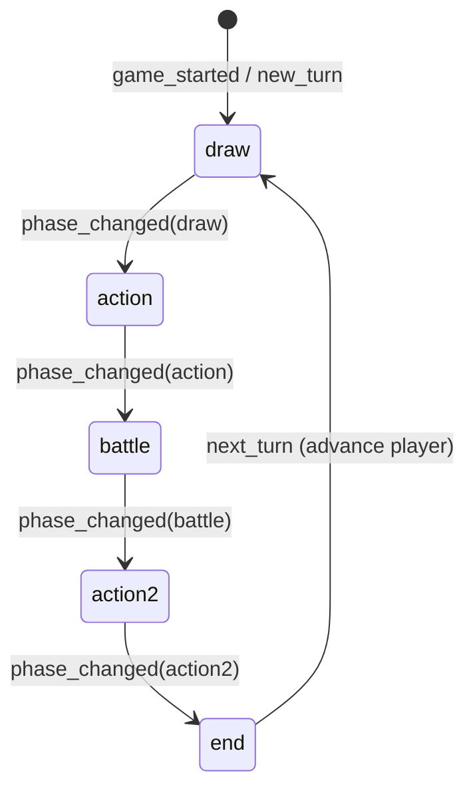

# Example: Base TCG With Standard Turn Phases

This document sketches how to model a **classic TCG turn structure** (draw → main action → battle → second action → end) using Teapot’s **component system**, the **workspace node graph** (React Flow), and how that maps to runtime behavior in **TeapotEngine**.

---

## 1. Who initializes what?

| Layer | Responsibility |
|--------|------------------|
| **Ruleset / scene** | Declares *which* components exist: one **game**, one **player** definition (cloned per seat), **containers** (zones), **objects** (systems or helpers). |
| **`MatchActor`** | At match start, creates **one game instance**, **one player instance per player id**, and **one instance per OBJECT/CONTAINER definition** in the ruleset. It wires the event bus and calls **`on_init`** on every scripted instance, then emits the system event **`game_started`**. |
| **Game component (`kind: game`)** | Should **not** re-create players, decks, or zones that are already defined in the ruleset. That duplicates the engine’s job and fights the data model. |
| **Game component’s real job** | Act as the **orchestrator** for *match flow*: turn index, active player, **phase state machine**, and **domain events** (`turn_started`, `phase_changed`, `main_open`, …) that other components subscribe to. In product terms this is your **GameManager** behavior, but in Teapot it lives on the **single root `game` component** unless you deliberately split logic into child **object** components (see below). |

**Practical rule:** Treat the **Game** component as a **Turn / phase coordinator** plus optional **bootstrap of purely dynamic** content (e.g. tokens spawned only at runtime via `game.instantiate()`). Treat **scene-level** entities as **declared in the ruleset** and **instantiated by the engine**.

---

## 2. Suggested component split

Minimal, typical TCG:

| Component | `kind` | Role |
|-----------|--------|------|
| **Standard TCG** | `game` | Phase FSM, `turn_number`, `current_phase`, emits lifecycle events, may call `game.set_active_player`, `game.emit`, `game.wait_for_input` where needed. |
| **Player** | `player` | Per-player stats (life, resources), hand ownership references, reactions to `turn_started` / `phase_changed` if rules are player-local. |
| **Deck / zones** | `container` | Deck, hand, field, graveyard; scripts or game logic use `game.move` / properties as your rules require. |
| **Combat resolver** (optional) | `object` | If combat rules are heavy, a dedicated **BattleSystem** object subscribes to `phase_changed` or `enter_battle` and encapsulates declare attackers/blockers and damage. The **game** component still *enters* the battle phase and *closes* it; the object executes battle rules. |

You can keep everything on the **game** component for a small example; split when the node graph or generated script gets unwieldy.

---

## 3. Event vocabulary (domain)

Use **`game.emit(event_type, payload)`** for anything other components should react to. Keep names stable so **GraphCompiler** can infer **`event_subscriptions`** from **event** nodes in each component’s graph.

Suggested strings (examples):

- `turn_started` — `{ "player_id": "<instance id>" }`
- `phase_changed` — `{ "phase": "draw" \| "action" \| "battle" \| "action2" \| "end" }`
- `draw_step_completed` — optional, if draw needs to sync UI or effects
- `main_phase_open` / `second_main_open` — if you need fine-grained UI gates
- `battle_phase_begin` / `battle_phase_end`
- `turn_ended`

The **game** component is usually the **emitter** for these. **Player**, **zones**, and **BattleSystem** **subscribe** to the subset they need.

---

## 4. Node graph: base **game** component (workspace)

The compiler summarizes nodes into a **ComponentBlueprint** (`GraphCompiler`): lifecycle flags, **event subscriptions**, **initial properties**, and a **node_summary** for codegen. Model the graph so it reflects **orchestration**, not low-level card rules (those can live on **object** components or deeper nodes).

### 4.1 Properties (property / variable nodes)

| Key | Example | Notes |
|-----|---------|--------|
| `phase_order` | `["draw","action","battle","action2","end"]` | Single source of truth for sequencing (can be a constant property or set in `on_init`). |
| `current_phase` | `"draw"` | Updated as the FSM advances. |
| `turn_number` | `1` | Increment when a full turn cycle completes for the active player. |

### 4.2 Lifecycle and events

- **`on_init`**: Initialize `turn_number`, `current_phase`, optionally seed `phase_order`. Do **not** loop “create all zones” here if they already exist in the ruleset.
- **`on_event`** (subscriptions): At minimum subscribe to **`game_started`** (after all `on_init`s have run) to kick off the first turn or first phase. Optionally subscribe to **`INPUT_RECEIVED`** if you branch on answers from `wait_for_input`.
- Other components subscribe to **`phase_changed`**, **`turn_started`**, etc., emitted by this component.

### 4.3 Graph topology (conceptual)

Think of the graph as **three bands**:

1. **Initialization** — property nodes + one **`on_init`** chain that sets defaults.
2. **Turn loop** — triggered by **`game_started`** and/or **`turn_started`** (if you emit it from the previous turn’s end handler).
3. **Phase chain** — a **linear sequence** of phase steps (draw → action → battle → action2 → end), implemented as:
   - **event** nodes that document which **`game.emit`** you will call at each transition, and  
   - **flow control** nodes (branch on `current_phase` / next index) if your UI tools use them, **or** a single **`on_update`** / **`win_condition`**-style node if you advance phases in one place.

Example **high-level** node layout (names match the compiler’s categories from `graph_compiler.py`):

```text
                    ┌─────────────────────┐
                    │ property: phase_order│
                    │ property: turn_number │
                    │ property: current_phase│
                    └──────────┬──────────┘
                               │
                    ┌──────────▼──────────┐
                    │ event_listener      │
                    │ eventType: game_started
                    └──────────┬──────────┘
                               │
              ┌────────────────┼────────────────┐
              │                │                │
    ┌─────────▼─────────┐      │     ┌──────────▼──────────┐
    │ event_trigger     │      │     │ on_update (opt.)  │
    │ emit turn_started │      │     │ advance_phase FSM  │
    └─────────┬─────────┘      │     └────────────────────┘
              │                │
    ┌─────────▼──────────────────────────────────────────┐
    │ Linear phase chain (documented as emit sequence):   │
    │   draw → action → battle → action2 → end            │
    │ Each step: set_property(current_phase) + emit(phase_changed) │
    │ Battle: optional wait_for_input or delegate to BattleSystem  │
    └──────────────────────────────────────────────────────┘
```

You do **not** need a separate physical node per line of Python; you need **clear labels and event types** so the **ComponentScriptGenerator** (and you) can implement one coherent `on_event` / helpers.

### 4.4 Phase state machine (behavioral)



- **draw**: emit `phase_changed`, then perform draw logic (or emit `draw_step_completed` after a script moves cards).
- **action**: first main phase — plays, lands, sorcery-speed actions per your rules.
- **battle**: combat; may **`wait_for_input`** for declare blockers or delegate to **BattleSystem** via `emit("battle_phase_begin")`.
- **action2**: second main — same as action for many TCGs.
- **end**: cleanup, “until end of turn” expiry, then emit `turn_ended`, switch **`game.set_active_player`**, increment `turn_number`, emit `turn_started` for the next player.

---

## 5. Script shape (illustrative, not generated)

The compiled script will implement hooks inferred from the graph. Conceptually the **game** component:

1. Listens for **`game_started`** → start first turn.
2. For each phase: **`game.set_property(game.self, "current_phase", phase)`**, then **`game.emit("phase_changed", {"phase": phase})`**.
3. Uses **`game.wait_for_input`** only when the rules require a discrete player choice at phase boundaries.
4. At **end**: **`game.set_active_player(next_player)`** and repeat.

Other components implement **`on_event`** for `phase_changed` and run zone or combat logic.

---

## 6. Summary

- **Initialization of the object graph** (game, players, static zones) is **engine + ruleset**, not a manual “god object” in the game script.
- The **`game` component** is the right place for **standard TCG turn phases**: it behaves like a **GameManager** for **flow and events**, while **MatchActor** remains the **lifecycle owner** of instances.
- The **node graph** should emphasize **properties**, **subscriptions** (`game_started`, optional `INPUT_RECEIVED`), and **documented emits** (`phase_changed`, `turn_started`, …) so compilation and multi-agent context stay aligned with **`GameContext.event_vocabulary`** and **`ComponentRelationship`** in your pipeline.

This gives you a single, reviewable **base game component** that coordinates a **draw → action → battle → action2 → end** loop without fighting Teapot’s architecture.
