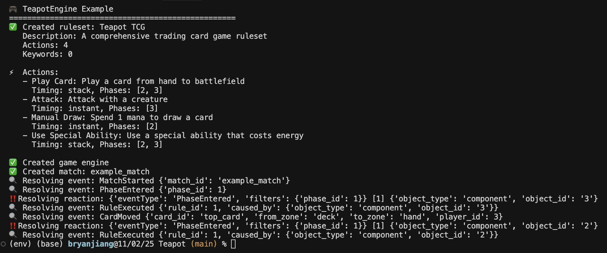
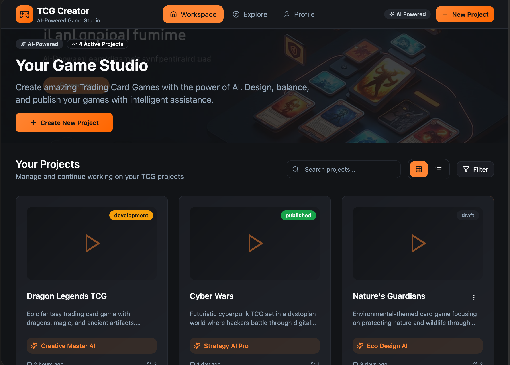
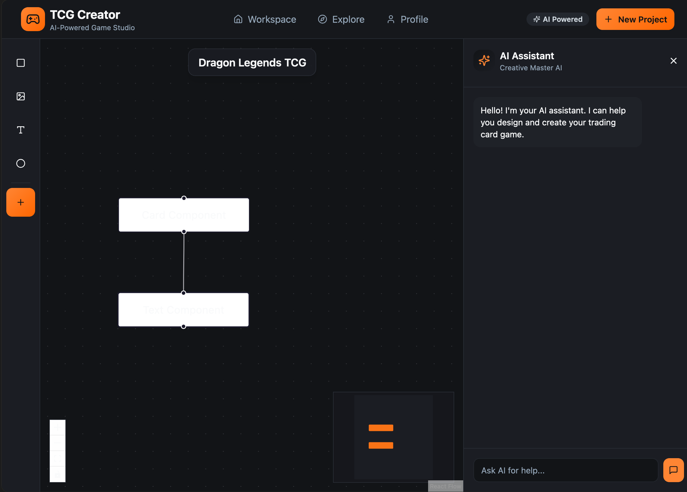

# Teapot Platform

## Overview
Teapot is an end-to-end platform for building and playing custom trading card games and board games, combining block-based no-code game construction and AI-assisted development, python-based rule engine, and a React-based workspace.【F:SystemArchitecture.md†L5-L60】

## Repository Structure
- **TeapotAPI/** – FastAPI backend handling authentication, data access, and foundational gameplay services with JWT auth, SQLAlchemy models, and health monitoring in place.【F:TeapotAPI/docs/README.md†L1-L66】
- **TeapotEngine/** – Shared Python engine that powers event-sourced matches, flexible JSON rulesets, and deterministic resolution via seeded RNG and an actor-based architecture.【F:TeapotEngine/README.md†L1-L152】
- **CreatorAPI/** – Multi-agent LLM pipeline that parses natural-language ability descriptions into structured JSON using specialized trigger, effect, target, and requirement agents working in parallel with recursive post-processing.【F:CreatorAPI/agent_architecture.txt†L1-L168】

## Key Technical Components
- **Reusable ruleset-driven engine** supporting custom actions, stack-based resolution, and JSON IR-defined mechanics that can be embedded by both client and server services. An example of the stack-based resolution system on a custom created ruleset:  
- **LLM-assisted creator tooling** featuring multi-agent pipelines to efficiently generate game rules and components and tool-validated outputs to transform text descriptions into game-ready data models.【F:CreatorAPI/agent_architecture.txt†L5-L168】
- **React-based developer workspace** Handles the game creation process. Here is an draft of how the interface will look like
  

## Workflow
1. User creates a project in the react workspace, developing the rules and components that makes up the game: Players, Cards, Tokens, Zones, Phases, Resources, etc.
2. Use an AI chat to efficiently develop components and rules, or manually create block-based workflow to represent game rules
3. **Start a game!** Simulate gameplay for single/multiplayer using a match engine that interprets any given rulesets. The server communicates with an Unity web game for easy accessibility
4. (Draft) Debug and simulate the game with a general game-playing AI model and easily generate specific test case scenarios with a game state generation Agent

## Next Steps
- Incorporate the React-based front end into this project
- Expand REST coverage with matches, card, and ruleset endpoints, and add WebSocket plus Redis support for live play.【F:TeapotAPI/docs/README.md†L67-L73】
- Follow the implementation roadmap to bring event sourcing, Unity state management, and React-based creator experiences online across upcoming phases.【F:ImplementationPlan.md†L1-L120】【F:SystemArchitecture.md†L15-L200】
- Continue expanding the AI generation flows by connecting prompt-based card, art, and rules suggestions into moderation and publishing workflows outlined in the architecture plan.
- Create and Fine-tune models for the general-game-playing agent.
